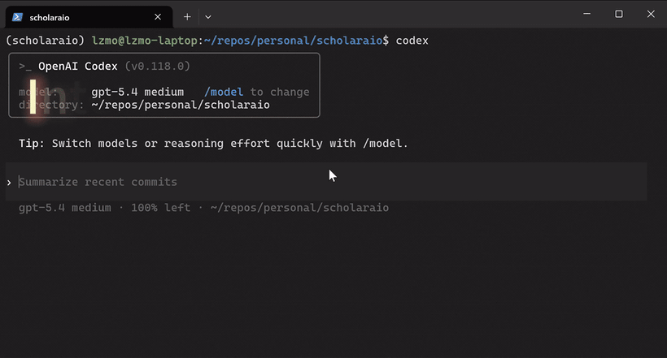
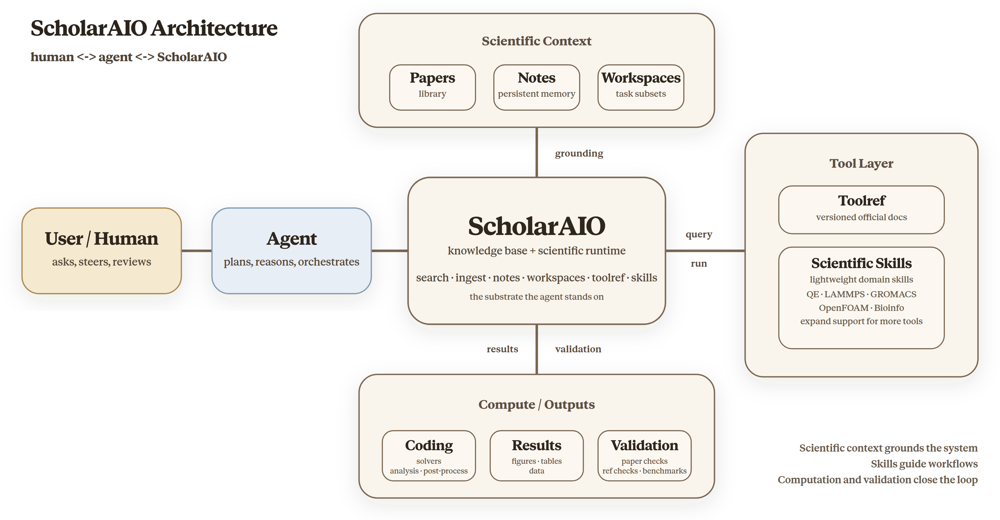

<div align="center">

<!-- TODO: 有 logo 后替换 -->
<!--  -->

# Scrinium

**面向 AI agent 的科研基础设施。**

[English](README.md) | [中文](README_CN.md)

[](https://github.com/wszqkzqk/scrinium/stargazers)
[](LICENSE)
[](https://www.python.org/)
[](.claude/skills/)

</div>

> **Fork 说明**：Scrinium 是 [ScholarAIO](https://github.com/ZimoLiao/scholaraio)（MIT）的 hard fork。原作版权归 Zi-Mo Liao 所有，见 [LICENSE](LICENSE)。

---

你的 coding agent 已经能读代码、写代码、跑实验。Scrinium 为它补上一套结构化的科研工作台，让它不仅能写代码，也能检索文献、对照论文校验结果、更准确地使用科学软件，并在一个终端里把整个科研流程串起来。

- 你的论文库会变成同一个 agent 可持续复用的知识底座。
- 遇到科学软件问题时，agent 可以在运行时查阅官方文档，而不是只靠 prompt 猜参数。
- 系统一开始就按“可以继续扩展更多工具和工作流”的方向来设计。

<div align="center">
  
</div>

Scrinium 给 AI coding agent 的不只是检索能力，而是一整套真正可用的科研工作台：自然语言交互、论文与研究笔记支撑、更准确地使用科学软件、代码编写与执行、基于文献的结果校验，以及结构化的论文写作。

<div align="center">
  
</div>

## 快速开始

默认也是最推荐的使用方式其实很简单：安装 Scrinium，完成一次配置，然后直接让你的 coding agent（Codex、Claude Code 或其他支持的 agent）打开这个仓库。

```bash
git clone https://github.com/wszqkzqk/scrinium.git
cd scrinium
pip install -e ".[full]"
scrinium setup
```

这样一来，agent 能得到最完整的使用体验：仓库内置指令、本地 skills、CLI 和完整代码上下文都会直接可用。Claude Code 插件、Codex/OpenClaw skills 注册，以及其他使用路径的详细说明，详见 [`docs/getting-started/agent-setup.md`](docs/getting-started/agent-setup.md)。

## 核心功能

|                               | 功能                           | 说明                                                                                        |
| ----------------------------- | ------------------------------ | ------------------------------------------------------------------------------------------- |
| **PDF 解析**                  | 深度结构提取                   | 将 PDF 转成结构化 Markdown，尽可能保留公式、图片和版面结构                                  |
| **不只是论文**                | 各种文档都能入                 | 期刊论文、学位论文、专利、技术报告、标准、讲义——五种 inbox 分类入库，各有针对性的元数据处理 |
| **融合检索**                  | 关键词 + 语义                  | 全文 + 向量混合检索（可关闭嵌入，走纯关键词模式）                                         |
| **策展标签**                  | agent 维护的主题词表           | agent 策展的受控标签体系（`data/tags.yaml`），标签进检索索引、支持 `--tag` 过滤——无嵌入部署下替代语义发现 |
| **主题发现**                  | 看清你的文献库在研究什么       | 自动把论文归成研究主题，并用交互式图形帮助你快速把握整体结构                                |
| **文献探索**                  | 多维度发现                     | 按期刊、主题、作者、机构、关键词、年份、引用影响力等多个维度探索一个研究方向                |
| **引用图谱**                  | 参考文献与影响力               | 正向引用、反向引用、共同引用分析                                                            |
| **分层阅读**                  | 按需加载                       | 先看元数据或摘要，再按需要深入到结论和全文，不必一开始就读完整篇                            |
| **多源导入**                  | 现有文献库可直接接入           | 从现有文献管理工具、PDF 和 Markdown 直接导入，不用从零重建你的文献库                        |
| **工作区**                    | 按项目整理                     | 论文子集管理，支持限定范围内的检索和 BibTeX 导出                                            |
| **多格式导出**                | BibTeX / RIS / Markdown / DOCX | 可导出整个文献库或工作区，直接用于 Zotero、Endnote、投稿或分享                              |
| **持久化笔记**                | 跨会话记忆                     | 把每篇论文的分析结论持续保存下来，下一次进入新会话时也能直接复用，不必从头重读              |
| **研究洞察**                  | 阅读行为分析                   | 搜索热词、高频阅读论文、阅读趋势、语义近邻推荐——帮助你发现可能忽略的文献                    |
| **联邦发现**                  | 跨库搜索                       | 把主库、探索库和 arXiv 放在同一个搜索入口里，不必在多个工具之间来回切换                     |
| **AI for Science 运行时能力** | 更准确地使用科学软件           | 在运行时直接对照官方文档使用科学软件，而不是靠猜命令、猜参数                                |
| **可扩展工具接入**            | 持续接入真正需要的软件         | 随着新的科学工具和工作流变得重要，系统可以继续扩展支持                                      |
| **学术写作**                  | AI 辅助撰写                    | 文献综述、论文章节、引用验证、审稿回复、研究空白分析——每条引用都可追溯到你自己的文献库      |


## 兼容你的 Agent

Scrinium 的设计目标是 **agent 无关**，但不同 agent 的接入方式并不完全一样。有些更适合直接打开仓库，有些则更适合通过插件来用。

| Agent / IDE                                                   | 直接打开本仓库                    | 在其他项目中复用           |
| ------------------------------------------------------------- | --------------------------------- | -------------------------- |
| [Claude Code](https://docs.anthropic.com/en/docs/claude-code) | `CLAUDE.md` + `.claude/skills/`   | Claude 插件市场            |
| [Codex](https://openai.com/codex) / OpenClaw                  | `AGENTS.md` + `.agents/skills/`   | 注册到 `~/.agents/skills/` |
| [Cline](https://github.com/cline/cline)                       | `.clinerules` + `.claude/skills/` | CLI + skills               |
| [Cursor](https://cursor.sh)                                   | `.cursorrules`                    | CLI + skills               |
| [Windsurf](https://codeium.com/windsurf)                      | `.windsurfrules`                  | CLI + skills               |
| [GitHub Copilot](https://github.com/features/copilot)         | `.github/copilot-instructions.md` | CLI + skills               |
| [Qwen Code](https://github.com/QwenLM/qwen-code)              | `QWEN.md`                         | CLI + skills               |

Skills 遵循开放的 [AgentSkills.io](https://agentskills.io) 标准，`.agents/skills/` 是 `.claude/skills/` 的符号链接，方便不同 agent 发现和复用。

**从现有工具迁移？** 支持从 Endnote（XML/RIS）和 Zotero（Web API 或本地 SQLite）直接导入——PDF、元数据、引用关系一并迁入。更多导入源持续开发中。

## 配置说明

> 请优先用agent打开scrinium，让它给你介绍配置方案，引导你上手scrinium，下面仅作基本说明

Scrinium 可以先用最小配置跑起来，再按需要逐步补强。

- `scrinium setup` 会带你完成基础配置。
- LLM API key 不是必须，但建议配置，用于更稳健鲁棒的元数据提取、内容补全。
- MinerU token 不是必须，但建议配置（免费）；你也可以本地部署 MinerU 或 Docling 来完成 PDF 解析。
- `scrinium setup check` 可以查看当前已装好什么、缺什么、哪些只是可选项。

完整说明见 [`docs/getting-started/agent-setup.md`](docs/getting-started/agent-setup.md) 和 [`config.yaml`](config.yaml)。

## 以 Agent 为主，也支持 CLI

Scrinium 最适合通过 AI coding agent 使用，但也提供 CLI，方便做脚本、排查和快速查询。与当前代码实现对齐的命令参考见 [`docs/guide/cli-reference.md`](docs/guide/cli-reference.md)。

## 项目结构

```
scrinium/             # Python 包——CLI、所有核心模块
  ingest/               #   PDF 解析 + 元数据提取流水线
  sources/              #   外部来源适配（arXiv / Endnote / Zotero）

.claude/skills/         # agent skills（AgentSkills.io 格式）
.agents/skills/         # ↑ 符号链接，方便跨 agent 发现
data/papers/            # 你的论文库（不进 git）
data/proceedings/       # 论文集库（不进 git）
data/inbox/             # 放入 PDF 即可入库
data/inbox-thesis/      # 放入学位论文（自动打标，跳过 DOI 判重）
data/inbox-patent/      # 放入专利（按公开号判重）
data/inbox-doc/         # 放入非论文文档（技术报告、标准、讲义等）
data/inbox-proceedings/ # 显式放入论文集 PDF/MD，走专用 proceedings 流程
```

完整模块参考 → [`docs/contributing.md`](docs/contributing.md)

## 引用

如果 Scrinium 对你的研究有帮助，欢迎引用：

```bibtex
@software{scrinium,
  author = {Zhou, Qiankang and Liao, Zi-Mo},
  title = {Scrinium: A Research Infrastructure for AI Agents},
  year = {2026},
  url = {https://github.com/wszqkzqk/scrinium},
  license = {GPL-3.0-or-later}
}
```

## 许可证

[GPL-3.0-or-later](LICENSE) © 2026 Zhou Qiankang。Scrinium 是 [ScholarAIO](https://github.com/ZimoLiao/scholaraio) 的 hard fork，原作 © 2026 Zi-Mo Liao 的部分仍以 [MIT License](NOTICE) 保留。
